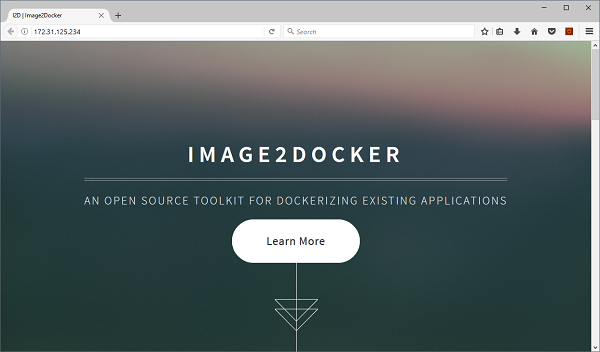

# Umbraco 

This is a stock install of [Umbraco](https://our.umbraco.org/), the open-source .NET Content Management System, which you can run in a Docker container on Windows.

## Usage 

```
docker run -d -P --name umbraco sixeyed/umbraco
```

Grab the IP address of the container, and browse to the website:

```
$ip = docker inspect --format '{{ .NetworkSettings.Networks.nat.IPAddress }}' umbraco
start "http://$ip"
```

You'll see the normal Umbraco setup screen, and you can go on to configure your site:


## Building a custom Umbraco image

You can use this image as a base to build a custom Docker image, with your Umbraco site already packaged. 

See how to do that with [umbraco-demo](../umbraco-demo/README.md):


